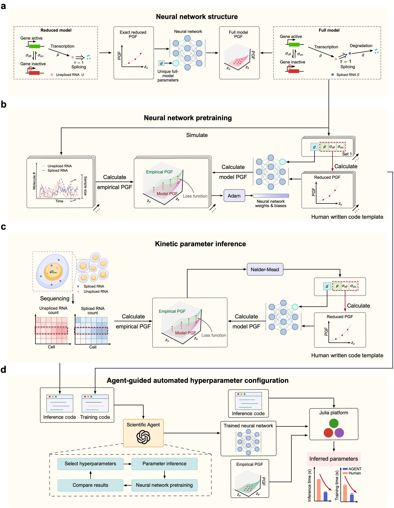

# AGENT enables scalable mechanistic inference of multivariate gene-expression dynamics

## Introduction

Single-cell multiomics measurements provide information about gene-expression dynamics across RNA and protein species. AGENT (Agent-guided Generating-function Estimation via Neural Transfer) uses an agent-guided neural framework to map the known probability generating function (PGF) of an analytically tractable reduced model to the joint PGF of a larger stochastic model. The trained network then serves as a surrogate for estimating kinetic parameters from observed counts. This repository (**AGENT_analysis**) organizes the inference examples, neural-network training code, released weights, and associated datasets.

---

## Tutorials

The AGENT neural-network structure, training workflow, and parameter-inference procedure are illustrated below.



A quick demo for applying AGENT to a delayed transcription-splicing model is available in [Tutorials.ipynb](Tutorials.ipynb). The tutorial explicitly constructs the two-species network, loads the released weights, converts counts to an empirical PGF, and estimates the kinetic parameters.

## Repository Structure

1. **[run_AGENT/](run_AGENT/)** contains the five AGENT inference examples and the retained comparison-method scripts.
    - **[Inference_AGENT2d.jl](run_AGENT/Inference_AGENT2d.jl)**: inference for a two-species delayed transcription-splicing model.
    - **[Inference_AGENT3d.jl](run_AGENT/Inference_AGENT3d.jl)**: inference for a three-species model including protein production and degradation.
    - **[Inference_AGENT_feedback.jl](run_AGENT/Inference_AGENT_feedback.jl)**: inference for an autoregulatory feedback network using the linear mapping approximation (LMA).
    - **[Inference_AGENT_toggle.jl](run_AGENT/Inference_AGENT_toggle.jl)**: inference for a toggle-switch network using LMA, including conversion to physical feedback rates.
    - **[Inference_AGENT_capture_rate.jl](run_AGENT/Inference_AGENT_capture_rate.jl)**: inference for a three-species model with joint capture-rate integration.
    - **[Inference_ABC.jl](run_AGENT/Inference_ABC.jl)**: approximate Bayesian computation (ABC).
    - **[Inference_Exact.jl](run_AGENT/Inference_Exact.jl)**: inference using an exact solution.
    - **[Inference_FSP.jl](run_AGENT/Inference_FSP.jl)**: maximum likelihood estimation with finite state projection (MLE+FSP).
    - **[Inference_MOM.jl](run_AGENT/Inference_MOM.jl)**: method of moments (MOM).
    - **[Inference_NNCME.jl](run_AGENT/Inference_NNCME.jl)**: neural-network-aided chemical master equation method (NNCME).

2. **[train_AGENT/](train_AGENT/)** contains training scripts and their complete input datasets, organized by model dimension.
    - **[2d/](train_AGENT/2d/)**: `train_AGENT2d.jl`, 2,807 parameter sets in `ps_for_train.txt`, reduced PGFs in `matrix_Gz1.csv` (7×2807), and full PGF targets in `matrix_Gz1z2.csv` (49×2807).
    - **[3d/](train_AGENT/3d/)**: `train_AGENT3d.jl`, 2,751 parameter sets in `ps_for_train.txt`, reduced PGFs in `matrix_Gz1.csv` (7×2751), and full PGF targets in `matrix_Gz1z2z3.csv` (343×2751).

    Parameter sets are stored as rows; PGF samples are stored as columns in the same sample order. Both models use seven quadrature nodes per axis and SSA targets generated with 10,000 trajectories. Training starts from random initialization and uses `tanh` hidden activations and `sigmoid` outputs:
    - **2D:** an 8–80–49 network; 2,000 Adam updates with `eta(t) = 0.03 * 0.1^((t-1)/1999)`, followed by up to 12,000 L-BFGS updates with history size 30.
    - **3D:** a 10–160–343 network; 3,350 Adam updates with `eta(t) = 0.03 * 0.1^((t-1)/3349)`, followed by up to 21,000 L-BFGS updates with history size 30.

3. **[parameters_trained/](parameters_trained/)** contains the released network weights and biases.
    - **[params_trained2d.txt](parameters_trained/params_trained2d.txt)**: weights for the two-species 8–80–49 network.
    - **[params_trained3d.txt](parameters_trained/params_trained3d.txt)**: weights for the three-species 10–160–343 network.

    Input standardization is already folded into the released first-layer weights. The training scripts also fold standardization into newly exported weights and do not overwrite these release files.

4. **[dataset/](dataset/)** contains synthetic inference data, real-data files, clustering code, and cell annotations.
    - **[synthetic_data/](dataset/synthetic_data/)**:
        - **counts_example2d.txt**: two-species delayed transcription-splicing counts.
        - **counts_example3d.txt**: three-species counts including protein.
        - **counts_example_feedback.txt**: autoregulatory feedback-network counts.
        - **counts_example_toggle.txt**: toggle-switch counts for both genes.
        - **counts_example_capture_rate.txt**: three-species counts with capture-rate effects.
        - **[ps_forinfer_2d.txt](dataset/synthetic_data/ps_forinfer_2d.txt)**: 400 ground-truth parameter sets for two-species inference, with columns `[sigma_on, sigma_off, rho, dm]`.
        - **[ps_forinfer_3d.txt](dataset/synthetic_data/ps_forinfer_3d.txt)**: 400 ground-truth parameter sets for three-species inference, with columns `[sigma_on, sigma_off, rho, dm, lambda, dp]`.
        - **β1β2.txt**: the original paired capture-rate samples used for joint KDE integration. The existing 7×7 integration weights are retained without renormalization.
    - **[cluster/](dataset/cluster/)**:
        - **cluster_ID/**: cell annotations for the CTCL and control datasets.
        - **cluster_CTCL.py**: clustering code for the CTCL dataset.
        - **cluster_ctrl.py**: clustering code for the control dataset.
    - **[real_data/](dataset/real_data/)**:
        - **190426_CTCL.loom**: CTCL spliced and unspliced RNA count matrices.
        - **190426_ctrl.loom**: control spliced and unspliced RNA count matrices.
        - **GSM3596101_CTCL-ADT-count.csv**: CTCL protein count matrix.
        - **GSM3596096_ctrl-ADT-count.csv**: control protein count matrix.

5. **[utils.jl](utils.jl)** provides shared mathematical utilities for the comparison scripts, including the reduced-model PGF, count/distribution-to-PGF conversion, histogram normalization, and distribution moments.

---

## Corresponding package

The corresponding Julia package is [AGENT.jl](https://github.com/X-Y-Zhou/AGENT.jl). In the Julia REPL, enter package mode with `]`, then install it:

```julia
] add https://github.com/X-Y-Zhou/AGENT.jl
```

Press Backspace to return to the Julia prompt and load the package:

```julia
using AGENT
```

For the analysis scripts and notebook, use **Julia 1.8.0** and place the `AGENT.jl` and `AGENT_analysis` repositories beside each other. From the `AGENT_analysis` directory, initialize the local project and run an example:

```sh
julia --project=. -e 'using Pkg; Pkg.instantiate()'
julia --project=. run_AGENT/Inference_AGENT2d.jl
```

The current `Manifest.toml` references the sibling `../AGENT.jl` directory. The optional `setup.jl` helper also registers this local package and installs the dependencies. The remaining four AGENT examples can be run in the same way using the filenames listed above. Open `Tutorials.ipynb` with a Julia kernel and `AGENT_analysis` as the working directory.

To start a new training run:

```sh
julia --project=. train_AGENT/2d/train_AGENT2d.jl
julia --project=. train_AGENT/3d/train_AGENT3d.jl
```

Code is distributed under the [MIT license](LICENSE).
